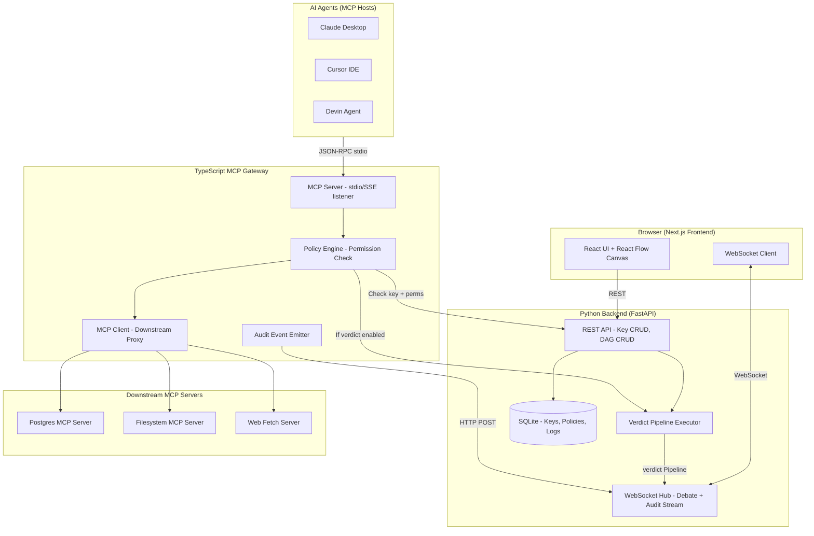

# Architecture Research — Verdict Studio & MCP Control Plane
## Updated with verified Verdict v0.2.7 API surface

## System Architecture (3-Process Design)



## Visual Node → Verdict API Mapping (CRITICAL for Code Exporter)

This is the exact mapping our DAG builder must implement when generating Python code:

### Node Type Mappings

| Visual Node | Verdict Class | Import Path | Key Constructor Args |
|-------------|--------------|-------------|---------------------|
| **InputNode** | `Schema.of(...)` | `from verdict.schema import Schema` | Dynamic fields from user input |
| **ProsecutorUnit** | `Unit(name="Prosecutor")` | `from verdict import Unit` | `.prompt()`, `.via()` — needs custom `ResponseSchema` subclass |
| **DefenseUnit** | `Unit(name="Defense")` | `from verdict import Unit` | `.prompt()`, `.via()` — needs custom `ResponseSchema` subclass |
| **FactCheckerUnit** | `Unit(name="FactChecker")` | `from verdict import Unit` | `.prompt()`, `.via()` — needs custom `ResponseSchema` subclass |
| **ChiefJusticeUnit** | `CategoricalJudgeUnit(name="ChiefJustice", categories=DiscreteScale([...]))` | `from verdict.common.judge import CategoricalJudgeUnit` | `.prompt()`, `.via()`, optional `.extract()` |
| **JudgeUnit** (generic) | `JudgeUnit(scale=..., explanation=...)` | `from verdict.common.judge import JudgeUnit` | `scale`: any `Scale`, `explanation`: bool |
| **CoTUnit** | `CoTUnit(name=...)` | `from verdict.common.cot import CoTUnit` | `.prompt()`, `.via()` |
| **AggregatorNode (MaxPool)** | `MaxPoolUnit()` | `from verdict.transform import MaxPoolUnit` | `fields=[]` — uses `statistics.mode` (majority vote!) |
| **AggregatorNode (MeanPool)** | `MeanPoolUnit()` | `from verdict.transform import MeanPoolUnit` | `fields=[]` — uses `statistics.mean` |
| **AggregatorNode (Map)** | `MapUnit(map_func=...)` | `from verdict.transform import MapUnit` | Custom callable |

### ⚠️ CRITICAL: Custom Unit ResponseSchema Requirement

The verdict library **requires** every custom `Unit` subclass to define a `ResponseSchema`. Simple `Unit(name="...")` instances cannot be used directly with `StructuredOutputExtractor` (the default) without a schema.

**Solution for Prosecutor/Defense/FactChecker nodes:**
The code exporter must generate custom Unit subclasses OR use `PostHocExtractor`/`RawExtractor`:

```python
# Option A: Custom subclass (recommended for type safety)
class ProsecutorUnit(Unit):
    class ResponseSchema(Schema):
        argument: str
        
# Option B: RawExtractor (simpler, single string output)
from verdict.extractor import RawExtractor
unit = Unit(name="Prosecutor").prompt("...").via("gpt-4o")
# Note: Would need RawExtractor or PostHocExtractor for free-form text
```

### Edge Connection → `>>` Operator Mapping

| Visual Connection | Generated Code |
|-------------------|---------------|
| Single node → Single node | `nodeA >> nodeB` |
| Multiple nodes in parallel → Single node | `Layer([nodeA, nodeB]) >> nodeC` |
| Single node → Multiple nodes in parallel | `nodeA >> Layer([nodeB, nodeC])` |
| Ensemble (3x same unit) | `Layer(unitTemplate, repeat=3)` |
| Sequential debate chain | `Layer([unitA, unitB, unitC], inner="chain")` |

### Layer Configuration Mapping

| Visual Setting | Generated `Layer` Args |
|---------------|----------------------|
| Parallel execution | `inner="none"` (default) |
| Sequential chain | `inner="chain"` |
| All-to-all connections | `outer="dense"` (default) |
| 1-to-1 broadcast | `outer="broadcast"` |
| Cumulative connections | `outer="cumulative"` |
| Last-only forward | `outer="last"` |

### Pipeline.run() Input Mapping

| Visual Input | Generated Code |
|-------------|---------------|
| Single text input | `Schema.of(query="...", context="...")` |
| Multiple inputs | `Schema.of(field1="...", field2="...", ...)` |
| Run single | `pipeline.run(input_data=Schema.of(...), max_workers=128)` |
| Run batch | `pipeline.run_from_list([Schema.of(...), ...])` |

## Prompt Template Variable Mapping

The code exporter must map these visual node references to verdict template variables:

| Visual Reference | Verdict Template Syntax | Resolution |
|-----------------|------------------------|------------|
| "Original Input" field | `{source.<field_name>}` | Pipeline input data |
| Output from upstream node | `{previous.<field_name>}` | If single dependency |
| Output from specific upstream node type | `{previous.<unittype>}` | Lowercase unit type name without "Unit" |
| Current unit's own attributes | `{unit.<attr>}` | Unit instance attributes |
| Current unit's conformed input | `{input.<field>}` | After schema conformance |

## Component Communication Matrix

| From → To | Protocol | Purpose |
|-----------|----------|---------|
| Frontend → FastAPI | REST (HTTP) | Key CRUD, DAG save/load, config generation |
| Frontend → FastAPI | WebSocket | Live debate stream, audit log stream |
| MCP Gateway → FastAPI | REST (HTTP) | Key validation, permission lookup, verdict trigger |
| MCP Gateway → Downstream | JSON-RPC (stdio) | Proxied tool execution |
| Agent → MCP Gateway | JSON-RPC (stdio/SSE) | Standard MCP protocol |

---
*Updated: 2026-08-25 | All Verdict mappings verified against source code | Confidence: HIGH*
