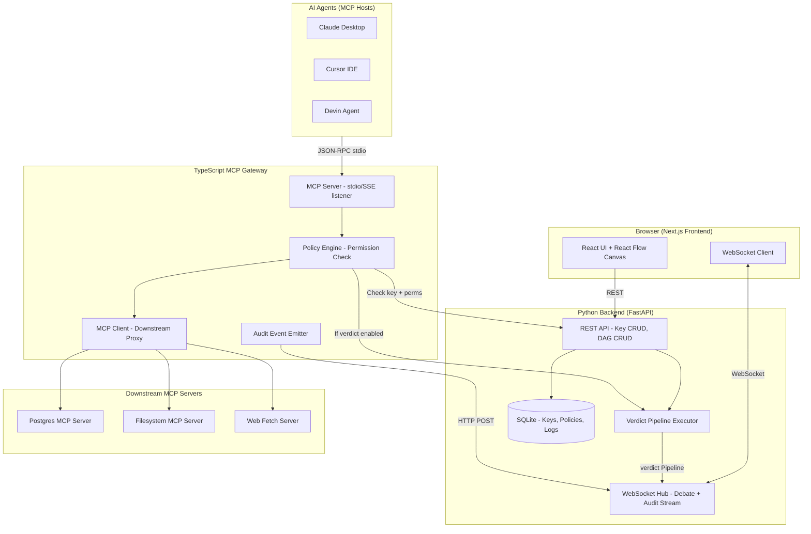

# Architecture Research — Verdict Studio & MCP Control Plane

## System Architecture (3-Process Design)



## Data Flow: MCP Tool Call with Verdict Enforcement

```
Agent (Claude) → JSON-RPC tools/call → MCP Gateway
  → Extract X-Haize-MCP-Key from request
  → Lookup key record in FastAPI backend (HTTP)
  → Check tool permissions (allow/deny/read-only)
  → If SQL tool: parse query for destructive ops
  → If web fetch: check domain whitelist
  → Forward to downstream MCP server
  → Receive tool result
  → If verdict enforcement enabled AND result > N tokens:
    → Send result to FastAPI verdict runner
    → Execute configured debate DAG (Prosecutor vs Defense → ChiefJustice)
    → If FAILED: block result, return safety warning
    → If PASSED: return original result
  → Emit audit event to WebSocket hub
  → Return result to agent
```

## Key Architectural Decisions

| Decision | Rationale |
|----------|-----------|
| **3 separate processes** (Next.js, FastAPI, MCP Gateway) | MCP Gateway must be a Node.js process for `@modelcontextprotocol/sdk` compatibility. FastAPI handles `verdict` (Python). Next.js serves the UI. |
| **FastAPI as orchestration hub** | Central point for key storage, verdict execution, and WebSocket streaming. Both the frontend and MCP gateway call into it. |
| **MCP Gateway as thin policy enforcer** | Gateway focuses on JSON-RPC protocol handling and permission checks. Delegates verdict execution to FastAPI. |
| **WebSocket for streaming** | Token-by-token debate viewing and real-time audit logs both require push-based communication. |
| **SQLite for v1** | Single-file database, zero setup, suitable for local development. Prisma makes future PostgreSQL migration trivial. |

## Component Communication Matrix

| From → To | Protocol | Purpose |
|-----------|----------|---------|
| Frontend → FastAPI | REST (HTTP) | Key CRUD, DAG save/load, config generation |
| Frontend → FastAPI | WebSocket | Live debate stream, audit log stream |
| MCP Gateway → FastAPI | REST (HTTP) | Key validation, permission lookup, verdict trigger |
| MCP Gateway → Downstream | JSON-RPC (stdio) | Proxied tool execution |
| Agent → MCP Gateway | JSON-RPC (stdio/SSE) | Standard MCP protocol |

---
*Researched: 2026-08-25 | Confidence: HIGH*
