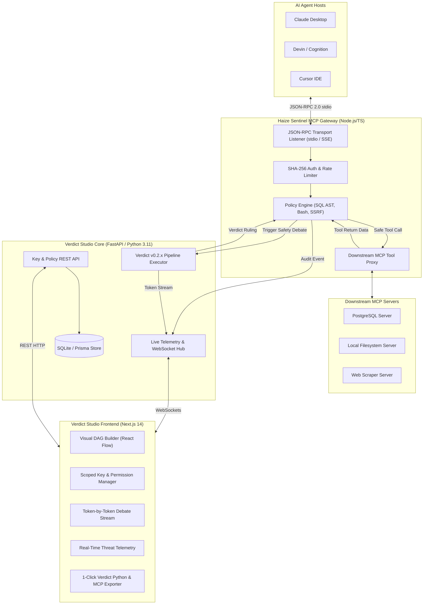

# Project 1: Verdict Studio & Haize Sentinel MCP Control Plane ⚖️🛡️
### *The Visual Multi-Agent Debate Studio, Scoped MCP Key Manager, & Test-Time Tool Security Firewall*

---

## 0. Executive Vision & Rationale

### A. The Core Industry Problem
Autonomous AI agents (e.g., **Claude Desktop, Devin, Cursor, and enterprise custom agents**) are rapidly adopting Anthropic's **Model Context Protocol (MCP)** to interact with production databases, cloud infrastructure, and bash terminals. However, two critical systemic vulnerabilities remain completely unsolved in the ecosystem:

1. **Lack of Visual Compound Evaluation Tooling:** Composing and debugging multi-agent debate pipelines (`haizelabs/verdict`) requires manual Python scripting without real-time visualization of inter-model arguments, token-by-token reasoning, or layer synchronization.
2. **Zero Scoped Tool Governance & Indirect Prompt Injection Vulnerabilities:** Once an agent connects to an MCP server, it inherits unrestricted tool access. Worse, when an agent reads untrusted external data (e.g., database records, web scrapes, customer tickets), **indirect prompt injections** can hijack the agent's context and execute catastrophic side-effects (e.g., `rm -rf /` or `DROP TABLE users;`).

### B. The Unified Solution: Verdict Studio + Haize Sentinel
**Verdict Studio & Haize Sentinel** bridges offline evaluation and inline agent governance into a single open-source control plane:

* 📊 **Visual DAG Studio:** A node-based canvas (`@xyflow/react`) to visually design, debug, and execute multi-agent debate evaluation graphs matching `haizelabs/verdict` v0.2.x primitives (`Unit`, `Layer`, `CategoricalJudgeUnit`, `CoTUnit`, `MaxPoolUnit`, `MapUnit`).
* 🛡️ **Haize Sentinel (MCP Security Gateway):** A scoped MCP proxy that intercepts agent tool requests, enforces granular tool permissions (AST-level Read-Only SQL, blocked Bash, domain whitelists), and **triggers an inline test-time Verdict debate** on untrusted tool returns before the LLM ingests them.
* ⚡ **Live Canvas Telemetry & Threat Stream:** When Claude Desktop or Devin executes a tool, the visual DAG canvas lights up in real time over WebSockets, displaying the inline safety debate and streaming execution audit logs.

```
┌──────────────────────────────────────────────────────────────────────────────────────────────────┐
│  VERDICT STUDIO & HAIZE SENTINEL CONTROL PLANE                                [ + Generate Key ] │
├──────────────────────────────────────────────────────────────────────────────────────────────────┤
│  [ NAVIGATION ]        │                                                                         │
│  • 📊 Visual DAG Studio│  [ SCOPED MCP KEY & SECURITY POLICIES ]                                 │
│  • 🛡️ Sentinel Gateway │  ┌────────────────────────────────────────────────────────────────────┐ │
│  • ⚡ Live Threat Feed │  │ Key: "Devin-Prod-Support"  | Hash: haize_mcp_live_8f3a9e...        │ │
│  • 📜 Audit Logs       │  │ Scoped Permissions & Guardrails:                                   │ │
│  ────────────────────  │  │  ☑️ db_query: Read-Only (AST-level: blocks DROP/UPDATE/DELETE)     │ │
│  [ DAG CANVAS ]        │  │  ⛔ bash_terminal: BLOCKED (High Risk Execution)                  │ │
│  Tool Return ──>       │  │  ☑️ fetch_web: Domain Whitelist (*.internal.corp.com)               │ │
│  ┌──────────────────┐  │  │  ⚖️ Inline Verdict Debate Firewall (>150 tokens): [ENABLED]        │ │
│  │ Prosecutor ⚔️    │  │  └────────────────────────────────────────────────────────────────────┘ │
│  │ Defense Unit     │  │                                                                         │
│  └────────┬─────────┘  │  [ 1-CLICK CLAUDE DESKTOP / DEVIN CONFIG GENERATOR ]                    │
│           ▼            │  { "mcpServers": { "haize": { "args": ["--key", "haize_mcp_..."] } } }  │
│  ┌──────────────────┐  │                                                                         │
│  │ Chief Justice    │  │  [ 1-CLICK VERDICT PYTHON CODE EXPORTER ]                               │
│  │ Ruling: PASSED   │  │  pipeline = Pipeline("SafetyShield") >> Layer([prosecutor, defense])... │
│  └──────────────────┘  │                                                                         │
├──────────────────────────────────────────────────────────────────────────────────────────────────┤
│  REAL-TIME MCP THREAT STREAM & AUDIT TELEMETRY:                                                 │
│  [18:42:01] Devin invoked 'db_query' -> "SELECT * FROM orders WHERE id=1" -> ✅ ALLOWED (AST OK) │
│  [18:42:09] Claude invoked 'db_query' -> "DROP TABLE customers;" -> 🚨 BLOCKED (SQL Guardrail)   │
│  [18:42:15] Cursor fetched 'http://untrusted-blog.com' -> ⚖️ VERDICT DEBATE: INJECTION DETECTED │
└──────────────────────────────────────────────────────────────────────────────────────────────────┘
```

---

## 1. Why Haize Labs Founders Will Be Blown Away

1. **Directly Fulfills Core Mission:** Haize Labs builds cutting-edge automated red-teaming, compound evaluation algorithms, and agent safety systems. This project gives their algorithms a premier developer console and deployment gateway.
2. **First-Ever Inline Verdict Firewall for Anthropic MCP:** Brings `verdict` from offline benchmark evaluation into **live, inline agent runtime protection**, proving test-time compute can defend agents in real time.
3. **Synergy with Anthropic & Cognition (Devin):** Directly addresses enterprise security concerns for organizations adopting Claude Desktop, Cursor, and Devin.
4. **Demonstrates Full-Stack Systems Mastery:** Unites high-performance Next.js 14 frontend engineering, custom React Flow node architectures, FastAPI WebSocket streaming, JSON-RPC 2.0 proxying, and cryptographic key governance.

---

## 2. Platform Architecture & Subsystems



---

## 3. Core Feature Breakdown

### A. Visual Multi-Agent DAG Studio (Frontend)
- **Interactive Drag-and-Drop Canvas:** Powered by `@xyflow/react` with custom styled nodes, typed handle validation, minimap, background grid, and undo/redo history.
- **Verdict v0.2.x Native Nodes:**
  - `InputNode`: Dynamic schema input source (maps to `verdict.schema.Schema.of(...)`).
  - `ProsecutorUnit`: Adversarial critique agent configured with prompt template and model via `.via()`.
  - `DefenseUnit`: Constructive justification agent configured with prompt template and model via `.via()`.
  - `FactCheckerUnit`: Empirical claim verifier.
  - `ChiefJusticeUnit`: Final adjudicator mapping to `CategoricalJudgeUnit` with `DiscreteScale` or `LikertScale`.
  - `CoTUnit`: Chain-of-thought scratchpad step.
  - `AggregatorNode`: Majority vote (`MaxPoolUnit`), mean pool (`MeanPoolUnit`), or custom transform (`MapUnit`).
- **Live Streaming Debate Viewer:** Split-pane console displaying sub-models debating token-by-token in real time over WebSockets with visual node glowing on active execution.
- **1-Click Python Code Exporter:** Generates 100% syntactically valid `haizelabs/verdict` v0.2.x Python code with correct imports, `Unit` subclasses, `Layer(repeat=N)` groupings, and pipeline runners.

### B. Haize Sentinel MCP Gateway (Security & Permission Control Plane)
- **Cryptographic Key Management:** Create scoped keys (`haize_mcp_live_...`) stored securely with SHA-256 hashing.
- **AST-Level SQL Guardrail:** Uses `sqlparse` to inspect SQL queries at the AST level, blocking `DROP`, `DELETE`, `UPDATE`, `ALTER`, `TRUNCATE`, and `INSERT` commands for Read-Only keys while allowing valid `SELECT` statements.
- **Bash Terminal Quarantine:** Explicitly block or whitelist allowed terminal commands for developer safety.
- **Domain Whitelist & SSRF Firewall:** Enforces wildcard domain matching (e.g., `*.internal.company.com`) on web fetching tools.
- **Inline Verdict Debate on Tool Returns:** When tool outputs exceed a token threshold or come from untrusted sources, Sentinel routes the payload through a fast Verdict debate DAG to detect prompt injections before the agent ingests the result.
- **1-Click MCP Config Snippets:** Instantly copy configured `claude_desktop_config.json`, Cursor, or Devin configurations pointing to `@haizelabs/sentinel-mcp`.

### C. Live Observability & Threat Matrix
- **Real-Time Audit Stream:** WebSockets broadcast all tool invocations with status (`ALLOWED`, `BLOCKED`, `VERDICT_REVIEW`), execution latency, key name, and violation reasons.
- **Threat Filter & Search:** Search and filter historical tool executions by key, status, tool name, or date range.
- **Export Audit Logs:** One-click CSV and JSON export for enterprise compliance audits.

---

## 4. Repository & Monorepo Structure

```
verdict-studio-mcp/
├── frontend/                            # Next.js 14 App Router + React Flow
│   ├── app/
│   │   ├── layout.tsx                   # Global layout with navigation sidebar
│   │   ├── page.tsx                     # Main executive dashboard
│   │   ├── dag-studio/page.tsx          # Visual Multi-Agent DAG Builder
│   │   ├── mcp-keys/page.tsx            # Scoped MCP Key & Security Manager
│   │   └── audit-logs/page.tsx          # Live tool execution & threat matrix
│   ├── components/
│   │   ├── Canvas.tsx                   # React Flow DAG Canvas
│   │   ├── nodes/                       # Custom Verdict visual nodes
│   │   │   ├── InputNode.tsx
│   │   │   ├── ProsecutorNode.tsx
│   │   │   ├── DefenseNode.tsx
│   │   │   ├── FactCheckerNode.tsx
│   │   │   ├── ChiefJusticeNode.tsx
│   │   │   ├── CoTNode.tsx
│   │   │   └── AggregatorNode.tsx
│   │   ├── NodeConfigDrawer.tsx         # Sidebar for node model & prompt editing
│   │   ├── KeyModal.tsx                 # Scoped key creation modal
│   │   ├── StreamingConsole.tsx         # Token-by-token live debate viewer
│   │   ├── CodeExportModal.tsx          # 1-click Verdict Python exporter
│   │   └── ConfigSnippetModal.tsx       # 1-click Claude Desktop config exporter
│   ├── lib/
│   │   ├── codeExporter.ts              # DAG JSON -> Native Verdict Python generator
│   │   └── websocket.ts                 # Resilient WebSocket connection manager
│   └── package.json
│
├── backend/                             # Python 3.11 + FastAPI Backend Core
│   ├── app/
│   │   ├── main.py                      # FastAPI REST endpoints & WebSocket hub
│   │   ├── engine/
│   │   │   ├── verdict_runner.py        # Compiles DAG JSON -> runs verdict.Pipeline
│   │   │   └── live_streamer.py         # Streams token chunks to WebSockets
│   │   ├── mcp_gateway/
│   │   │   ├── policy_engine.py         # AST SQL validation & SSRF checks
│   │   │   └── key_auth.py              # SHA-256 key hashing and verification
│   │   └── models/                      # Pydantic schemas (Key, Policy, Log, DAG)
│   └── requirements.txt
│
├── mcp-gateway/                         # TypeScript MCP Gateway Proxy
│   ├── src/
│   │   ├── index.ts                     # MCP Server stdio / SSE entry point
│   │   ├── proxy.ts                     # Downstream MCP client router
│   │   └── sentinel.ts                  # Intercepts tools/call & verifies permissions
│   ├── package.json
│   └── tsconfig.json
│
├── .planning/                           # Structured GSD Lifecycle & Research Specs
└── README.md
```

---

## 5. Master Verification Criteria

| Capability | Verification Procedure | Expected Result |
| :--- | :--- | :--- |
| **Visual DAG Composition** | Drag `InputNode` $\to$ `Layer([Prosecutor, Defense])` $\to$ `ChiefJustice` | Canvas connects valid handles and serializes graph state. |
| **Live Debate Streaming** | Click "Run Debate" on canvas | Token-by-token debate streams in UI split-pane via WebSockets. |
| **1-Click Code Export** | Click "Export Python" $\to$ run code with `python test.py` | Native script runs successfully using `verdict` v0.2.7. |
| **Scoped Key Creation** | Generate key with `db_query` Read-Only and `bash` Disabled | Hashed key record created; Claude Desktop snippet generated. |
| **AST SQL Guardrail** | Agent executes `DROP TABLE users;` via MCP Gateway | Intercepted in <10ms; rejected with `BLOCKED (SQL Violation)`. |
| **Verdict Tool Firewall** | Agent fetches untrusted web page with prompt injection | Tool return triggers Verdict debate $\to$ malicious payload quarantined. |
| **Live Telemetry** | Execute tool calls in Claude Desktop | Live Audit Log and DAG canvas light up with real-time events. |

---

## 6. Founder Pitch & Demo Script

### 45-Second Screen Recording Flow:
1. **0:00 - 0:15:** Drag and drop a Prosecutor and Defense model on the DAG canvas, configure a Chief Justice node, and hit **Run Debate** to show live token-by-token streaming debate.
2. **0:15 - 0:25:** Open the **Sentinel MCP Control Plane**, generate a scoped key for `Claude-Desktop-Support`, toggle on **Read-Only SQL** and **Verdict Debate on Tool Returns**, and copy the config snippet.
3. **0:25 - 0:35:** Open Claude Desktop. Ask Claude to execute `DROP TABLE customers;` against a local SQLite database. Show the Haize Sentinel MCP Gateway immediately intercepting and rejecting the query with a red policy violation.
4. **0:35 - 0:45:** Show the **Live Threat Feed** updating in real time with the blocked violation and token metrics.

### Founder Outreach Message (to Leonard Tang / Richard Liu / Steve Li):
> *"Hi Leonard,*
> 
> *With autonomous agents rapidly adopting Anthropic's Model Context Protocol (MCP), production teams face a massive security gap: **how to govern agent tool permissions and protect against indirect prompt injections at runtime**.*
> 
> *To solve this, I built and open-sourced **Verdict Studio & Haize Sentinel**:*
> * 📊 **Visual DAG Studio:** A drag-and-drop builder for composing `haizelabs/verdict` multi-agent debate pipelines with live token streaming and 1-click Python code export.
> * 🛡️ **Haize Sentinel MCP Gateway:** A scoped API key manager for Claude Desktop, Cursor, and Devin that enforces AST-level Read-Only SQL, bash quarantine, and **inline Verdict safety debates on tool returns** before agents ingest them.
> * ⚡ **Live Threat Telemetry:** Real-time WebSocket observability stream tracking every agent tool invocation and policy violation.
> 
> *I’d love to bring this level of full-stack systems engineering and product vision to Haize Labs as a SWE Intern!"*
