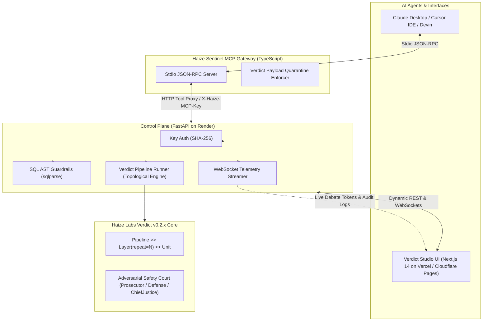

# Verdict Studio & Haize Sentinel MCP Control Plane

[](https://github.com/haizelabs/verdict)
[](https://modelcontextprotocol.io/)
[](https://nextjs.org/)
[](https://vercel.com/)
[](https://render.com/)
[]()
[]()

> **Verdict Studio & Haize Sentinel** is an enterprise-grade visual DAG pipeline builder, live multi-agent debate playground, and scoped Model Context Protocol (MCP) security gateway built natively on top of Haize Labs' [`haizelabs/verdict`](https://github.com/haizelabs/verdict) library and Anthropic's Model Context Protocol (MCP).

---

## Key Capabilities

1. **Visual Multi-Agent DAG Studio (Frontend)**
   - **Custom Reactive Nodes**: `InputNode`, `ProsecutorUnit`, `DefenseUnit`, `FactCheckerUnit`, `ChiefJusticeUnit`, `CoTUnit`, and `AggregatorNode` (`MaxPoolUnit` via majority vote).
   - **Real-Time Token Streaming**: WebSocket telemetry console (`StreamingConsole.tsx`) streaming tokens chunk-by-chunk with glowing node execution states.
   - **1-Click Python Code Exporter**: Generates 100% syntactically valid standalone Python scripts using native `haizelabs/verdict` v0.2.x DSL.
   - **Multi-Turn Dynamic Prompt Substitution**: Automatically injects previous node arguments (e.g. `{previous.prosecutor}`, `{previous.defense}`) into downstream judge prompts.

2. **Client-Side BYOK (Bring Your Own Key) & Simulation Fallback**
   - **100% Optional Keys**: Zero-key visitors instantly experience interactive multi-agent debate simulations with zero blocking dialogs.
   - **Live Inference Engine**: Pass OpenAI, Anthropic Claude, or Custom Base URLs (OpenRouter, Groq, Together AI, local Ollama) for real model execution.
   - **Client-Side Privacy**: Keys are cached strictly in browser `localStorage` and passed ephemerally in execution requests.

3. **Scoped MCP Key & Permission Control Plane (Backend & Security Gateway)**
   - **Cryptographic Key Hashing**: Issues `haize_mcp_live_<token>` keys with SHA-256 validation.
   - **AST-Level SQL Guardrails**: Tokenizes SQL with `sqlparse` AST inspector to block `DROP`, `DELETE`, `UPDATE`, `INSERT`, and `ALTER` on Read-Only keys while permitting `SELECT`.
   - **Inline Verdict Safety Debate Defense**: Intercepts unverified tool outputs and triggers multi-agent Adversarial Safety Court debates to quarantine indirect prompt injection vectors before the host model ingests them.
   - **1-Click Agent Configuration**: Generates copy-pasteable JSON configs for **Claude Desktop** (`claude_desktop_config.json`), **Cursor IDE** (`.cursor/mcp.json`), and **Devin Agent**.

4. **Live Security Audit Logs & Threat Matrix**
   - Live WebSocket event ingestion (`/ws/telemetry`) tracking tool calls, latencies, and violations.
   - Multi-criteria filtering by Agent Key, Tool name, and Status (`ALLOWED`, `BLOCKED`, `VERDICT_REVIEW`).
   - 1-Click CSV and JSON export.

---

## System Architecture



---

## Full-Stack Production Deployment

Verdict Studio is architected for cloud-native deployment with **Vercel / Cloudflare Pages** (Frontend) and **Render** (Backend):

### 1. Backend Deployment (Render)
1. Fork or push this repository to GitHub.
2. In the [Render Dashboard](https://dashboard.render.com/), click **New + > Web Service** and select this repo.
3. Configure the service using [`render.yaml`](./render.yaml) or with these manual settings:
   - **Environment**: `Python 3`
   - **Root Directory**: `backend`
   - **Build Command**: `pip install -r requirements.txt`
   - **Start Command**: `uvicorn app.main:app --host 0.0.0.0 --port $PORT`
4. Note your public backend URL (e.g. `https://verdict-studio-backend.onrender.com`).

### 2. Frontend Deployment (Vercel or Cloudflare Pages)
1. In the [Vercel Dashboard](https://vercel.com/), click **Add New > Project** and import the repository.
2. Configure the project settings:
   - **Root Directory**: `frontend`
   - **Framework Preset**: `Next.js`
3. Add Environment Variables under **Settings > Environment Variables**:
   - `NEXT_PUBLIC_API_URL`: `https://<your-render-app>.onrender.com`
   - `NEXT_PUBLIC_WS_URL`: `wss://<your-render-app>.onrender.com`
4. Click **Deploy**.

---

## Local Development Quickstart

### Prerequisites
- Python 3.10+
- Node.js 18+ & npm

### Step 1: Start the FastAPI Backend
```bash
cd backend
pip install -r requirements.txt
python3 -m uvicorn app.main:app --host 0.0.0.0 --port 8000 --reload
```
*Backend runs on `http://localhost:8000` (`GET /api/health`, WebSocket `/ws/telemetry`)*

### Step 2: Start the Next.js Frontend
```bash
cd frontend
npm install
npm run dev
```
*Frontend runs on `http://localhost:3000`*

### Step 3: Run the TypeScript MCP Gateway (for Claude Desktop / Cursor)
```bash
cd mcp-gateway
npm install
npx tsx src/index.ts --key haize_mcp_live_demo1234567890abcdef12345678 --backend-url http://localhost:8000
```

---

## Claude Desktop & Cursor Configuration

### Claude Desktop (`claude_desktop_config.json`)
```json
{
  "mcpServers": {
    "haize-sentinel": {
      "command": "npx",
      "args": [
        "-y",
        "@haizelabs/sentinel-mcp",
        "--key",
        "haize_mcp_live_YOUR_KEY_HERE",
        "--backend-url",
        "https://verdict-studio-backend.onrender.com"
      ]
    }
  }
}
```

### Cursor IDE (`.cursor/mcp.json`)
```json
{
  "mcpServers": {
    "haize-sentinel": {
      "command": "node",
      "args": [
        "/path/to/mcp-gateway/dist/index.js",
        "--key",
        "haize_mcp_live_YOUR_KEY_HERE"
      ],
      "env": {
        "HAIZE_BACKEND_URL": "https://verdict-studio-backend.onrender.com"
      }
    }
  }
}
```

---

## Comprehensive Test Suite

Run the full automated test suite verifying Python DAG runner, BYOK fallback, AST SQL guardrail engine, and Playwright UI matrix:

```bash
# 1. Run Python backend integration tests (11/11 Passed)
python3 -m unittest discover -s backend/tests -p "test_*.py" -v

# 2. Run Playwright Component Matrix (24/24 Passed)
node frontend/scripts/exhaustive_component_audit.js

# 3. Run Playwright End-to-End User Flow Audit (4/4 Passed)
node frontend/scripts/e2e_browser_audit.js

# 4. Run MCP Gateway stdio test runner
node mcp-gateway/tests/e2e_test.js
```

---

## Repository Structure

```
verdict_studio/
├── .env.example                  # Root full-stack environment variables template
├── render.yaml                   # Infrastructure-as-code for Render deployment
├── DEPLOYMENT.md                 # Complete Vercel, Cloudflare Pages & Render deployment runbook
├── PROJECT_1_VERDICT_STUDIO.md   # Architectural specification & technical deep-dive
├── frontend/                     # Next.js 14 App Router, React Flow & Tailwind
│   ├── .env.example              # Frontend environment variables template
│   ├── next.config.mjs           # Next.js static HTML export configuration
│   ├── app/
│   │   ├── page.tsx              # Executive Dashboard & System Health
│   │   ├── dag-studio/page.tsx   # Visual Multi-Agent DAG Studio
│   │   ├── mcp-keys/page.tsx     # Scoped MCP Key Manager & Permission Engine
│   │   └── audit-logs/page.tsx   # Live Security Audit Logs & Telemetry
│   ├── components/
│   │   ├── Canvas.tsx            # @xyflow/react Canvas with custom edge styles
│   │   ├── NodePalette.tsx       # Compact draggable Verdict Node Palette
│   │   ├── NodeConfigDrawer.tsx  # Node configuration drawer (.prompt, .via, scale)
│   │   ├── StreamingConsole.tsx  # Live debate WebSocket terminal with BYOK indicator
│   │   ├── SettingsModal.tsx     # Optional Client-Side BYOK Settings modal
│   │   ├── CodeExportModal.tsx   # 1-Click Python code export modal
│   │   ├── KeyModal.tsx          # Key creation modal with permission toggles
│   │   ├── ConfigSnippetModal.tsx# 1-Click Claude / Cursor config generator
│   │   ├── Sidebar.tsx           # Navigation with Gateway Core health indicator
│   │   └── nodes/                # 7 Custom React Flow Verdict Nodes
│   └── lib/
│       ├── config.ts             # Dynamic API_BASE_URL & WS_BASE_URL resolver
│       ├── codeExporter.ts       # Standalone Python script generator
│       ├── dagPresets.ts         # Pre-built Verdict debate architectures
│       └── dagSerializer.ts      # DAG JSON import/export parser
├── backend/                      # FastAPI, Verdict Runner & Policy Engine
│   ├── .env.example              # Backend environment variables template
│   ├── Procfile                  # Process definition for Render / PaaS
│   ├── requirements.txt          # Python dependencies (FastAPI, uvicorn, httpx, sqlparse)
│   ├── app/
│   │   ├── main.py               # API routes, WebSocket hub, datastores & CORS
│   │   ├── engine/
│   │   │   ├── verdict_runner.py # Topological DAG compiler & BYOK execution engine
│   │   │   └── live_streamer.py  # WebSocket token streaming generator
│   │   ├── mcp_gateway/
│   │   │   ├── key_auth.py       # SHA-256 key generation & constant-time auth
│   │   │   └── policy_engine.py  # AST SQL parser (sqlparse) & domain sentry
│   │   └── models/               # Pydantic models for DAGs, Keys, and Audits
│   └── tests/
│       └── test_integration.py   # 11/11 End-to-End full-stack integration tests
└── mcp-gateway/                  # TypeScript Stdio MCP Gateway
    ├── src/
    │   ├── index.ts              # Model Context Protocol stdio server
    │   ├── verdict_enforcer.ts   # Inline Verdict prompt injection quarantine
    │   └── types.ts              # TypeScript MCP contracts
    └── tests/
        └── e2e_test.js           # Automated stdio JSON-RPC test runner
```

---

## Ecosystem & Links

- **Official Haize Labs Verdict**: [`haizelabs/verdict`](https://github.com/haizelabs/verdict)
- **Project Repository**: [`sohampawar1866/verdict-studio`](https://github.com/sohampawar1866/verdict-studio)
- **Builder / Author**: [Soham Sanjay Pawar](https://github.com/sohampawar1866) | [LinkedIn](https://www.linkedin.com/in/sohampawar1866/) | [Devfolio](https://devfolio.co/@sohampawar1866)

---

## License

Apache 2.0. Built for **Haize Labs** and the open-source AI safety engineering community.
